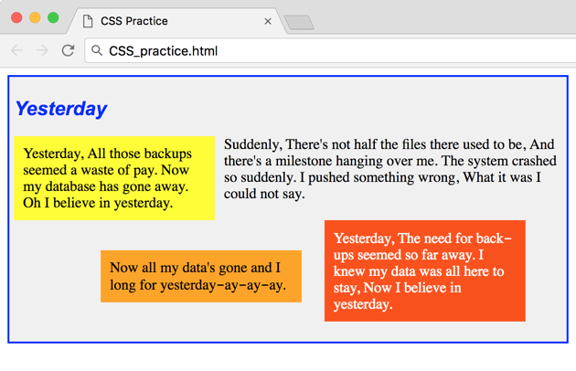

## Overview

In this lab you are going to practice more CSS!

## Videos

- [VSCode and Git Installed](https://www.youtube.com/watch?v=lix7G-S8ox8)
- [Class Coding standards](https://shanep-web.github.io/docs/coding-standards.html)
- [Cloning and Submitting](https://shanep-web.github.io/docs/github.html)

## Task 1 - Write CSS (25pts)

Use CSS to format the web page so it looks exactly like the screenshot below:



- Use a `<div>` for each of the 4 verse containers and the outer container.
- The title “Yesterday” uses an `<h2>` tag with a 16pt Arial font that is blue and italicized. Do not use an `<i>` tag.
- The entire song is embedded in a container that is 600 x 280 pixels, has a two
  pixel solid blue border, and a five pixel padding. The background color is
  #F0F0F0.
- The outer `<div>`'s first child is the `<h2>`. The 4 child `<div>`s follow, declared in the order listed below.
- The yellow section:
  - has a background color of "yellow"
  - floats to the left
  - has a 200 pixel width
  - has a 10 pixel padding
  - has a right margin of 10 pixels, with all other margins set to 0
- The section with no background color has no CSS styling.
- The orange section:
  - has a background color of "orange"
  - is positioned at (110px, 200px) with absolute positioning
  - has a 200 pixel width
  - has a 10 pixel padding
- The orange-red section:
  - has a background color of "rgb(255, 80, 0)"
  - has white text
  - floats to the right
  - has a 200 pixel width
  - has a 10 pixel padding
  - has a right margin of 40 pixels, a top margin of 20 pixels, and all other margins set to 0
- Do not use `<br>` anywhere in your HTML.

## Task 2 - Unit testing (10pts)

Copy the tests below into your testing file and run all the tests. 100% of the tests must pass!

```javascript
QUnit.test('Main <div> has proper styles and no <br> tags are used', function(assert) {

    var allDIVs = document.getElementsByTagName("div");
    assert.ok(allDIVs.length > 0, "At least 1 <div> exists on the page");
    var mainDIV = allDIVs[0];
    var mainDIVStyle = window.getComputedStyle(mainDIV);

    assert.equal(mainDIVStyle.backgroundColor, "rgb(240, 240, 240)",
        "Outer container has correct background color");

    const sides = ["Left", "Top", "Right", "Bottom"];
    sides.forEach((side, i) => {
        var prefix = "border" + side;
        assert.equal(mainDIVStyle[prefix + "Style"], "solid",
            "Outer container has solid border");
        assert.equal(mainDIVStyle[prefix + "Width"], "2px",
            "Outer container has border width of 2 pixels");
        var clr = mainDIVStyle[prefix + "Color"];
        assert.equal(clr, "rgb(0, 0, 255)",
            "Outer container has blue border");
    });

    assert.equal(mainDIVStyle.width, "600px",
        "Outer container has width of 600 pixels");
    assert.equal(mainDIVStyle.height, "280px",
        "Outer container has height of 280 pixels");
    sides.forEach((side, i) => {
        assert.equal(mainDIVStyle["padding" + side], "5px",
            `Outer container has ${side.toLowerCase()} padding of 5 pixels`);
    });
});

QUnit.test('Main <div> contains <h2> with proper styles', function(assert) {
    var allDIVs = document.getElementsByTagName("div");
    assert.ok(allDIVs.length > 0, "At least 1 <div> exists on the page");
    var mainDIV = allDIVs[0];

    var childH2s = mainDIV.getElementsByTagName("h2");
    assert.equal(childH2s.length, 1, "Main <div> contains a single <h2>");
    var theStyle = window.getComputedStyle(childH2s[0]);
    assert.equal(theStyle.color, "rgb(0, 0, 255)",
        "<h2> has correct font color");
    assert.equal(theStyle.fontStyle, "italic",
        "<h2> has italic font style");
});

QUnit.test('Yellow <div> has proper styles', function(assert) {
    var allDIVs = document.getElementsByTagName("div");
    assert.ok(allDIVs.length > 0, "At least 1 <div> exists on the page");
    var yellowDIV = allDIVs[1];

    const expectedText = "Yesterday, All those backups seemed a waste of pay. " + 
        "Now my database has gone away. Oh I believe in yesterday.";
    assert.equal(yellowDIV.innerText, expectedText,
        "Yellow container contains expected verse text");
    var theStyle = window.getComputedStyle(yellowDIV);
    assert.equal(theStyle.backgroundColor, "rgb(255, 255, 0)",
        "Yellow container has correct background color");
    const sides = ["Left", "Top", "Right", "Bottom"];
    sides.forEach((side, i) => {
        assert.equal(theStyle["padding" + side], "10px",
            `Yellow container has 10 pixel ${side.toLowerCase()} padding`);
    });

    assert.equal(theStyle.float, "left", "Yellow container floats to the left");
    assert.equal(theStyle.width, "200px", "Yellow container has 200 pixel width");
    assert.equal(theStyle.marginRight, "10px", "Yellow container has 10 pixel right margin");
    assert.equal(theStyle.marginLeft, "0px", "Yellow container has 0 pixel left margin");
    assert.equal(theStyle.marginTop, "0px", "Yellow container has 0 pixel top margin");
    assert.equal(theStyle.marginBottom, "0px", "Yellow container has 0 pixel bottom margin");
});

QUnit.test('No-color <div> has proper styles', function(assert) {
    var allDIVs = document.getElementsByTagName("div");
    assert.ok(allDIVs.length > 0, "At least 1 <div> exists on the page");
    var theDIV = allDIVs[2];
    const expectedText = "Suddenly, There's not half the files there used to be, And there's a " + 
        "milestone hanging over me. The system crashed so suddenly. I pushed something wrong, " + 
        "What it was I could not say.";
    assert.equal(theDIV.innerText, expectedText,
        "No-color container contains expected verse text");
    var theStyle = window.getComputedStyle(theDIV);
    assert.equal(theStyle.backgroundColor, "rgba(0, 0, 0, 0)",
        "No-color container has correct background color");
    assert.equal(theStyle.float, "none",
        "No-color container has default float style");
});

QUnit.test('Orange <div> has proper styles', function(assert) {
    var allDIVs = document.getElementsByTagName("div");
    assert.ok(allDIVs.length > 0, "At least 1 <div> exists on the page");
    var orangeDIV = allDIVs[3];
    const expectedText = "Now all my data's gone and I long for yesterday-ay-ay-ay.";
    assert.equal(orangeDIV.innerText, expectedText,
        "Orange container contains expected verse text");
    var theStyle = window.getComputedStyle(orangeDIV);
    assert.equal(theStyle.backgroundColor, "rgb(255, 165, 0)",
        "Orange container has correct background color");
    assert.equal(theStyle.position, "absolute", "Orange container uses absolute positioning");
    assert.equal(theStyle.left, "110px", "Orange container's left position is 110 pixels");
    assert.equal(theStyle.top, "200px", "Orange container's top position is 200 pixels");
    assert.equal(theStyle.float, "none", "Orange container has default float (none)");
    assert.equal(theStyle.width, "200px", "Orange container has 200 pixel width");

    const sides = ["Left", "Top", "Right", "Bottom"];
    sides.forEach((side, i) => {
        assert.equal(theStyle["padding" + side], "10px",
            `Orange container has 10 pixel ${side.toLowerCase()} padding`);
    });
});

QUnit.test('Orange-red <div> has proper styles', function(assert) {
    var allDIVs = document.getElementsByTagName("div");
    assert.ok(allDIVs.length > 0, "At least 1 <div> exists on the page");
    var orDIV = allDIVs[4];
    const expectedText = "Yesterday, The need for back-ups seemed so far away. I knew " + 
        "my data was all here to stay, Now I believe in yesterday.";
    assert.equal(orDIV.innerText, expectedText,
        "Orange-red container contains expected verse text");
    var theStyle = window.getComputedStyle(orDIV);
    assert.equal(theStyle.backgroundColor, "rgb(255, 80, 0)",
        "Orange-red container has correct background color");
    assert.equal(theStyle.color, "rgb(255, 255, 255)",
        "Orange-red container has correct text color");
    assert.equal(theStyle.float, "right", "Orange-red container floats right");
    assert.equal(theStyle.width, "200px", "Orange-red container has 200 pixel width");
    const sides = ["Left", "Top", "Right", "Bottom"];
    sides.forEach((side, i) => {
        assert.equal(theStyle["padding" + side], "10px",
            `Orange-red container has 10 pixel ${side.toLowerCase()} padding`);
    });

    assert.equal(theStyle.marginRight, "40px", "Orange-red container has 40 pixel right margin");
    assert.equal(theStyle.marginLeft, "0px", "Orange-red container has 0 pixel left margin");
    assert.equal(theStyle.marginTop, "20px", "Orange-red container has 20 pixel top margin");
    assert.equal(theStyle.marginBottom, "0px", "Orange-red container has 0 pixel bottom margin");
});

```

## Task 3 - Flipgrid (10pts)

Show off your website to the class. Once you have everything ready create a video using flipgrid!

- [How to record your screen](https://help.flip.com/hc/en-us/articles/360045940833-Screen-Recording-How-to-record-your-screen-using-the-Flipgrid-camera)
- [Flipgrid topic]({{site.data.semester-info.flip[page.slug]}})

You need to demo the following:

- Show the completed page(s).
- Show your unit tests passing

## Task 4 - Complete the Retrospective (5pts)

Once you have completed all the tasks open the file **Retrospective.md** and complete each section with a TODO comment.

## Task 5 - Add, Commit, Push your code

Once you are finished you need to make sure that you have pushed all your code to GitHub for grading!
